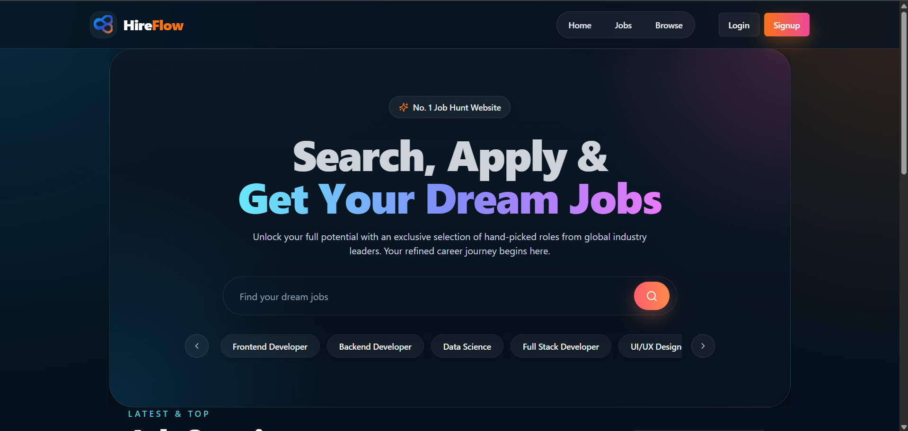
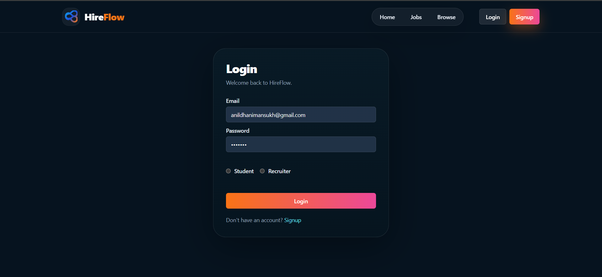
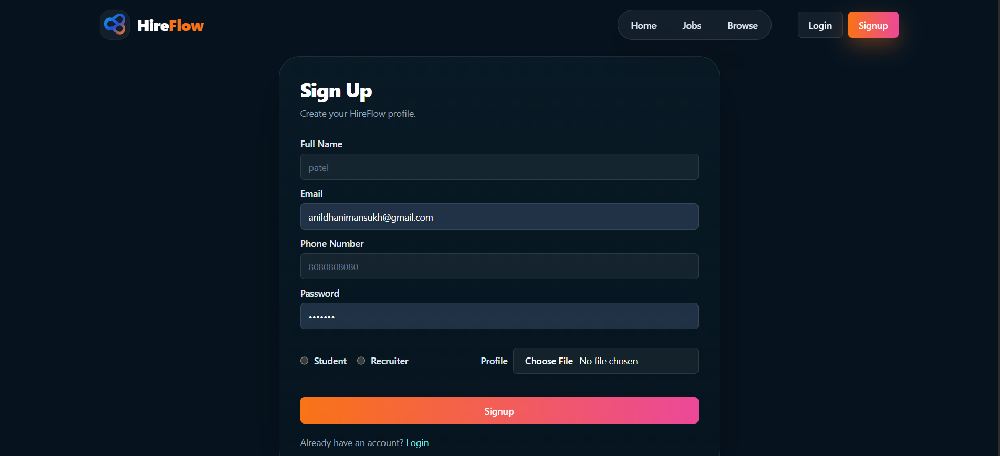
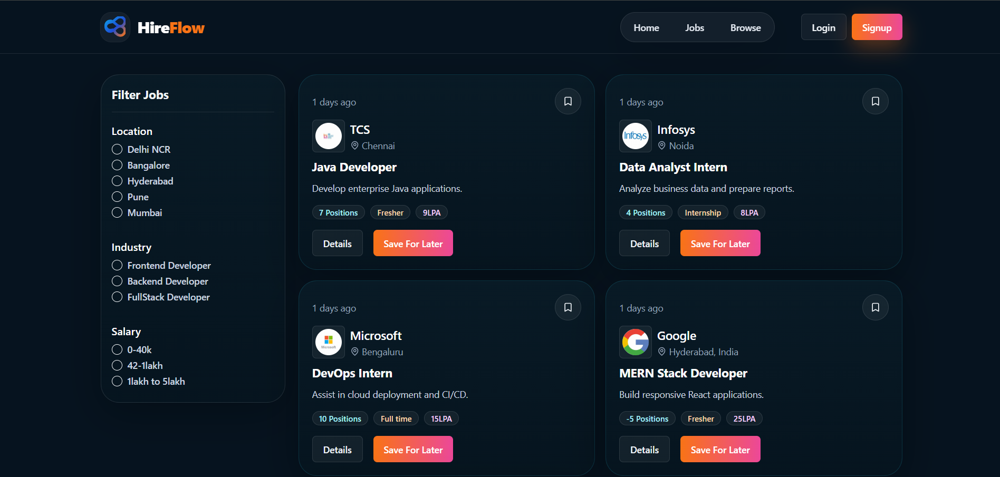
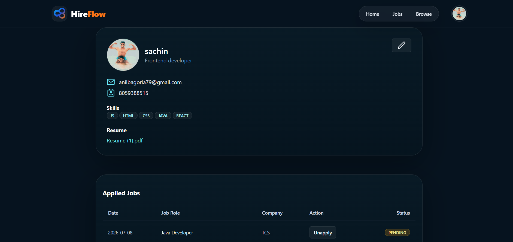
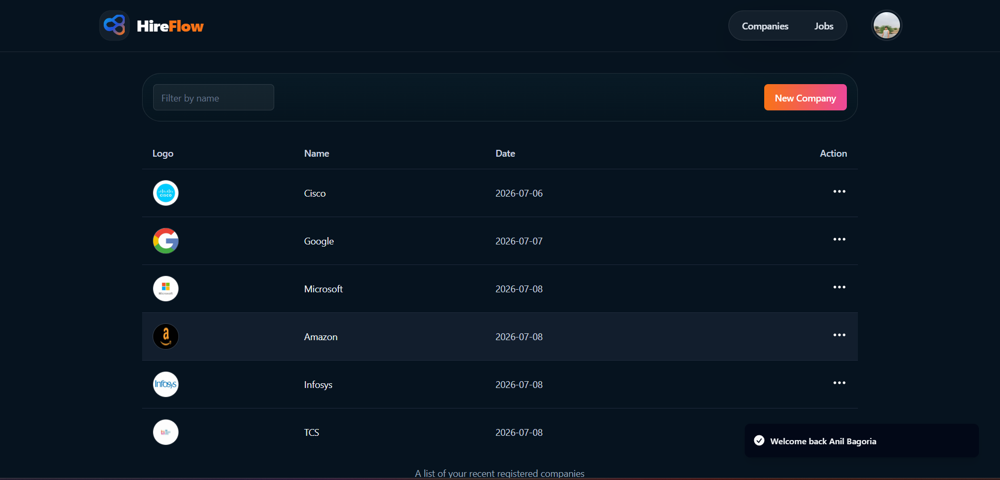

# 🚀 HireFlow – Full Stack MERN Job Portal

> A modern full-stack Job Portal built using the MERN Stack that connects job seekers with recruiters through a secure, responsive, and user-friendly platform.


---

# 📖 About

HireFlow is a Full Stack MERN Job Portal designed to simplify the hiring process for both recruiters and job seekers.

Recruiters can create companies, post jobs, and manage applicants, while students and professionals can browse opportunities, upload resumes, apply for jobs, and track their application status.

The project follows a scalable MERN architecture with secure authentication and a responsive user interface.

---

# ✨ Features

## 👨‍💻 Job Seeker

- 🔐 Secure User Authentication
- 👤 Profile Management
- 📄 Resume Upload
- 💼 Browse Available Jobs
- 🔍 Search & Filter Jobs
- 📌 Apply for Jobs
- 📊 Track Application Status

---

## 🏢 Recruiter

- 🔐 Recruiter Authentication
- 🏢 Company Registration
- ➕ Create & Manage Jobs
- 📋 View Posted Jobs
- 👥 Manage Applicants
- ✏️ Update Application Status

---

## 🔒 Security

- JWT Authentication
- Password Hashing (BcryptJS)
- Protected Routes
- Role-Based Authorization
- Secure Cookie Authentication

---

# 🛠 Tech Stack

### Frontend

- React.js
- Vite
- Tailwind CSS
- Shadcn UI
- Redux Toolkit
- React Router DOM
- Framer Motion

### Backend

- Node.js
- Express.js

### Database

- MongoDB
- Mongoose

### Authentication

- JWT
- BcryptJS

### File Upload

- Multer

---

# 📂 Project Structure

```
HireFlow
│
├── backend
├── frontend
├── screenshots
├── README.md
└── package-lock.json
```

---

# 📸 Project Screenshots

## 🏠 Home Page

Landing page where users can explore jobs and navigate through the platform.



---

## 🔐 Login Page

Secure login page for users and recruiters.



---

## 📝 Signup Page

New users can register and create their accounts.



---

## 💼 Jobs Page

Browse available jobs with search and filtering options.



---

## 👤 Profile Page

Manage profile information and uploaded resume.



---

## 🏢 Recruiter Dashboard

Recruiters can manage companies, jobs, and applicants.



---

# ⚙️ Installation

## Clone Repository

```bash
git clone https://github.com/anilbagoria/HireFlow.git
```

## Backend Setup

```bash
cd backend
npm install
npm run dev
```

## Frontend Setup

```bash
cd frontend
npm install
npm run dev
```

---

# 🔑 Environment Variables

Create a `.env` file inside the backend folder.

```env
PORT=
MONGO_URI=
JWT_SECRET=
CLOUDINARY_CLOUD_NAME=
CLOUDINARY_API_KEY=
CLOUDINARY_API_SECRET=
```

---

# 🚀 Project Workflow

```text
User Login / Signup
        │
        ▼
JWT Authentication
        │
        ▼
User Dashboard
        │
 ┌──────┴────────┐
 │               │
 ▼               ▼
Browse Jobs   Recruiter Dashboard
 │               │
 ▼               ▼
Apply Job     Post Job
 │               │
 ▼               ▼
Application   View Applicants
 │               │
 └──────┬────────┘
        ▼
     MongoDB
```

---

# 🚀 Future Enhancements

- 🤖 AI Interview Preparation
- 🤖 AI Resume Analysis
- 📊 Resume ATS Score
- 📧 Email Notifications
- 🔔 Real-time Notifications
- 📅 Interview Scheduling
- 📈 Recruiter Analytics Dashboard
- 🌙 Dark Mode

---

# 👨‍💻 Author

**Anil Bagoria**

🎓 Computer Science Engineering Student

🏫 SGSITS, Indore

📧 Email: **anilbagoria15012003@gmail.com**

---

# ⭐ Support

If you found this project useful, consider giving it a ⭐ on GitHub.

It motivates me to build more useful open-source projects.
